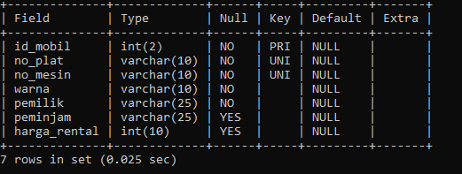
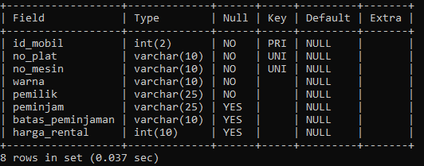
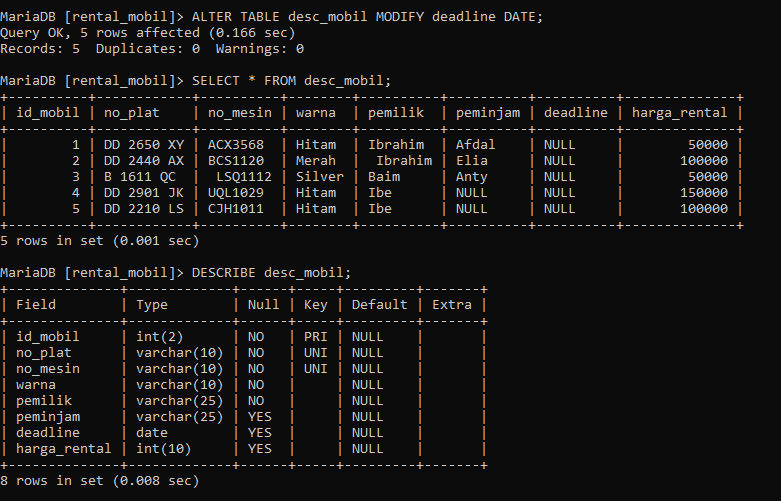
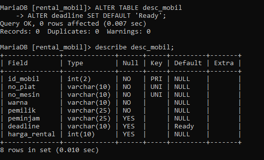
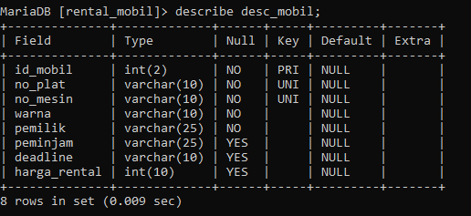
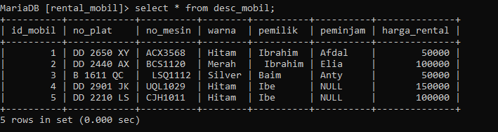
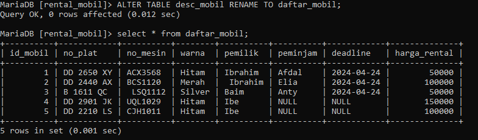

# Menambah kolom

## Struktur

```mysql
ALTER TABLE nama_table ADD nama_kolom typedata(nilaidata) AFTER nama_kolom;
```
## Contoh
```mysql
ALTER TABLE desc_mobil ADD batas_peminjaman varchar(10) AFTER peminjam;
```
`After` Opsional untuk digunakan, jika tidak menggunakan klausa ini maka secara default kolom yang dibuat akan berada di akhir. Jika kolom ingin ditaruh pada awal kolom maka gunakan klausa `First`. dan hasilnya sebagai berikut:
## Hasil
### Before
Sebelum menggunakan query alter



### After
Sesudah menggunakan query alter



## Analisis

- `ALTER TABLE`: Ini adalah perintah SQL yang digunakan untuk memodifikasi struktur tabel yang ada.
- `desc_mobil`: Ini adalah nama tabel yang diubah.
- `ADD`: Kata kunci ini menunjukkan bahwa sebuah kolom baru ditambahkan ke dalam tabel.
- `batas_peminjaman`: Ini adalah nama kolom baru yang ditambahkan.
- `varchar(10)`: Ini menentukan tipe data dari kolom baru. `varchar` adalah string karakter berpanjang variabel, dan `(10)` menunjukkan bahwa itu dapat menampung hingga 10 karakter.
- `AFTER peminjam`: Ini menentukan posisi di mana kolom baru akan ditambahkan. Dalam hal ini, itu akan ditambahkan setelah kolom `peminjam`.
## Kesimpulan

Jadi, kesimpulan program ini adalah bahwa ia menambahkan kolom `batas_peminjaman` ke tabel `desc_mobil`, di mana kolom baru tersebut merupakan string teks dengan panjang maksimal 10 karakter, dan kolom ini akan ditempatkan setelah kolom `peminjam` dalam struktur tabel.
# Mengubah Nama Kolom
## Struktur

```mysql
ALTER TABLE nama_table CHANGE nama_kolom nama_kolom typedata(nilaidata);
```
## Contoh
```mysql
ALTER TABLE desc_mobil CHANGE batas_peminjaman deadline varchar(10);
```
## Hasil


## Analisis
- `ALTER TABLE`: Ini adalah perintah SQL yang digunakan untuk memodifikasi struktur tabel yang sudah ada.
- `desc_mobil`: Ini adalah nama tabel yang akan diubah.
- `CHANGE batas_peminjaman deadline varchar(10)`: Ini adalah perintah untuk mengubah nama dan tipe data kolom. Kolom yang sebelumnya bernama `batas_peminjaman` akan diubah menjadi `deadline`. Selain itu, tipe data kolom ini diubah menjadi `varchar(10)`, yang berarti itu adalah string teks dengan panjang maksimal 10 karakter.

## Kesimpulan

Kesimpulan perintah ini melakukan dua perubahan pada tabel `desc_mobil`: mengubah nama kolom dari `batas_peminjaman` menjadi `deadline`, dan mengubah tipe data kolom tersebut menjadi `varchar(10)`.

# Mengubah Tipe Data Kolom
## Struktur

```mysql
ALTER TABLE nama_table  MODIFY nama_kolom typedata;
```
## Contoh

```mysql 
ALTER TABLE desc_mobil  MODIFY deadline DATE;
```
## Hasil


## Analisis

- `ALTER TABLE` adalah perintah SQL yang digunakan untuk mengubah struktur tabel yang sudah ada.
- `desc_mobil` adalah nama tabel yang akan diubah.
- `MODIFY deadline DATE` adalah klausa yang menentukan kolom `deadline` yang akan diubah dan tipe datanya menjadi `DATE`.
## Kesimpulan

Kesimpulannya, program `ALTER TABLE desc_mobil MODIFY deadline DATE;` digunakan untuk mengubah tipe data kolom `deadline` dalam tabel `desc_mobil` menjadi `DATE`. Perubahan ini memungkinkan kolom `deadline` untuk hanya menyimpan nilai tanggal, dan memungkinkan operasi dan pemrosesan yang lebih tepat terhadap data tanggal yang terkait.
# Menambahkan Constraint
## Struktur

```mysql
ALTER TABLE (nama_tabel)
    ALTER (nama_kolom) SET DEFAULT (nilai_default );
```
## Contoh

```mysql
ALTER TABLE desc_mobil
    ALTER deadline SET DEFAULT 'Ready';
```
## Hasil


## Analisis

- `ALTER TABLE`adalah SQL
- `desc_mobil`adalah sebuah nama tabel
- `ALTER deadline`adalah sebuah klausa`deadline`dalam`desc_mobil`
- `SET DEFAULT 'Ready'`adalah`deadline`kolom
## Kesimpulan

Program `ALTER TABLE desc_mobil ALTER deadline SET DEFAULT 'Ready';` mengubah nilai default kolom `deadline` dalam tabel `desc_mobil` menjadi `'Ready'`. Ini berarti bahwa jika tidak ada nilai yang diberikan secara eksplisit saat melakukan operasi `INSERT` pada tabel `desc_mobil`, maka kolom `deadline` akan memiliki nilai default `'Ready'`.
# Menghapus Constraint
## Struktur

```mysql
 ALTER TABLE (nama_tabel)
    ALTER (nama_kolom) DROP DEFAULT;
```
## Contoh

```mysql
ALTER TABLE desc_mobil
     ALTER deadline DROP DEFAULT;
```
## Hasil


## Analisis

- `ALTER TABLE` adalah perintah SQL yang digunakan untuk mengubah struktur tabel yang sudah ada.
- `desc_mobil` adalah nama tabel yang akan diubah.
- `ALTER deadline` adalah klausa yang menentukan kolom `deadline` yang akan diubah.
- `DROP DEFAULT` adalah klausa yang digunakan untuk menghapus nilai default dari kolom.
## Kesimpulan

Program `ALTER TABLE desc_mobil ALTER deadline DROP DEFAULT;` menghapus nilai default dari kolom `deadline` dalam tabel `desc_mobil`. Setelah menjalankan program ini, kolom `deadline` tidak akan memiliki nilai default, dan jika tidak ada nilai yang diberikan secara eksplisit saat melakukan operasi `INSERT`, kolom `deadline` akan memiliki nilai `NULL`.
# Menghapus Kolom
## Struktur

```mysql
ALTER TABLE nama_tabel DROP COLUMN nama_kolom;
```
## Contoh

```mysql
ALTER TABLE desc_mobil DROP COLUMN deadline;
```
## Hasil


## Analisis

- `ALTER TABLE`adalah perintah SQL yang digunakan untuk mengubah struktur tabel yang ada.
- `desc_mobil`adalah nama tabel yang sedang diubah.
- `DROP COLUMN`adalah klausa yang digunakan untuk menghapus kolom tertentu dari tabel.
- `deadline`adalah nama kolom yang dihilangkan dari `desc_mobil`tabel.
## Kesimpulan

Singkatnya, program ini menginstruksikan sistem manajemen basis data untuk menghapus `deadline`kolom dari `desc_mobil`tabel. Setelah menjalankan program ini, `deadline`kolom tersebut tidak akan ada lagi di struktur tabel, dan data apa pun yang disimpan di kolom tersebut akan dihapus secara permanen.
# Mengganti Nama Tabel
## Struktur

```mysql
 ALTER TABLE nama_tabel_saat_ini RENAME TO nama_tabel_yang_ingin_diganti;
```
## Contoh

```mysql
 ALTER TABLE desc_mobil RENAME TO daftar_mobil;
```
## Hasil


## Analisis

- `ALTER TABLE` adalah perintah SQL yang digunakan untuk mengubah struktur tabel yang sudah ada.
- `desc_mobil` adalah nama tabel yang akan diubah.
- `RENAME TO` adalah klausa yang digunakan untuk mengubah nama tabel.
- `daftar_mobil` adalah nama baru yang diberikan kepada tabel.
## Kesimpulan

Program `ALTER TABLE desc_mobil RENAME TO daftar_mobil;` mengubah nama tabel `desc_mobil` menjadi `daftar_mobil`. Setelah menjalankan program ini, tabel yang sebelumnya bernama `desc_mobil` akan berganti nama menjadi `daftar_mobil`.


